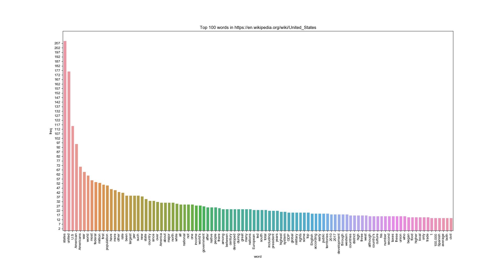

# wiki_scraper
Scrapes data from the body of a Wikipedia article and creates a quick bar graph visualization of its top contents.

### Usage
The following libraries are required to run this script:
- requests
- BeautifulSoup
- Matplotlib (comes with Anaconda)
- seaborn (comes with Anaconda)

Run as `python wiki_scraping WIKI_URL` to visualize the Wikipedia article at that URL.

Otherwise, leave the `WIKI_URL` option out and it will use a sample URL.

### TODO:
- Crawl multiple wiki pages / support for loading URLs via stdin/piping
- Better deal with punctuation and numbers
- Store computed data in CSV format
- Include more statistical functions than the simple word frequency used here